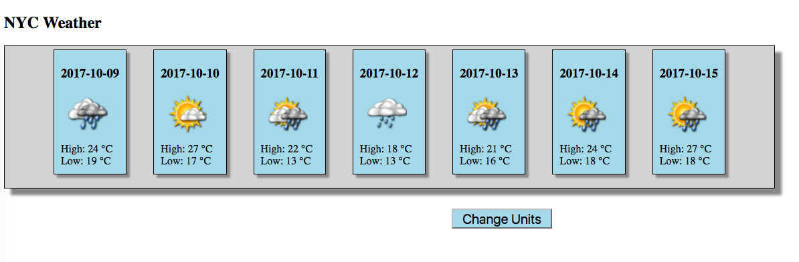

## NYC Weather App



A simple responsive React app that renders the forecast in Farenheit or Celsius.
Not meant for production, made for a coding challenge.

Note: In order to run this app properly, you will need API keys from
[Aeris Weather](https://www.aerisweather.com/). Once you have them, create
a file in the app's directory called `config.js` and enter the keys in this
format:

```javascript

var config = {
  MY_KEY : 'YOUR KEY',
  SECRET_KEY : 'YOUR SECRET KEY'
}

```
